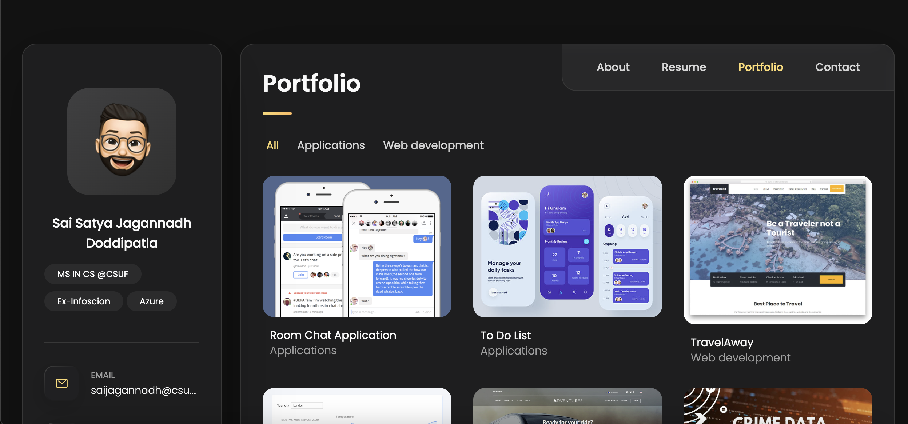

<div align="center">

# 🌐 Personal Portfolio — Sai Satya Jagannadh Doddipatla

### My résumé, projects and contact info as a fast, responsive single-page site.

[](https://saisatyajagannadh.github.io/PersonalPortfolio/)


**👉 [saisatyajagannadh.github.io/PersonalPortfolio](https://saisatyajagannadh.github.io/PersonalPortfolio/)**

</div>

---

## 📸 Preview



## ✨ Sections

- 👤 **About** — what I do: Gen AI, data engineering, and full-stack builds
- 📄 **Resume** — education, coursework, experience, technical skills and certifications
- 🧩 **Portfolio** — project cards with links
- ✉️ **Contact** — reach me directly

Pure HTML/CSS/JS — no framework, no build step, loads instantly.

## 🚀 Run locally

```bash
git clone https://github.com/SaiSatyaJagannadh/PersonalPortfolio.git
cd PersonalPortfolio && open index.html
```

Layout inspired by [serranopuente.github.io](https://github.com/serranopuente/serranopuente.github.io). MIT licensed.

---

<div align="center">

**Built by [Sai Satya Jagannadh Doddipatla (DJ)](https://saisatyajagannadh.github.io/PersonalPortfolio/)** · ⭐ Star the repo if it helped

</div>
